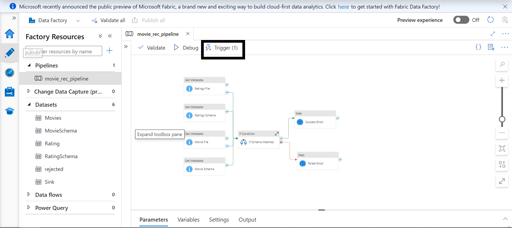
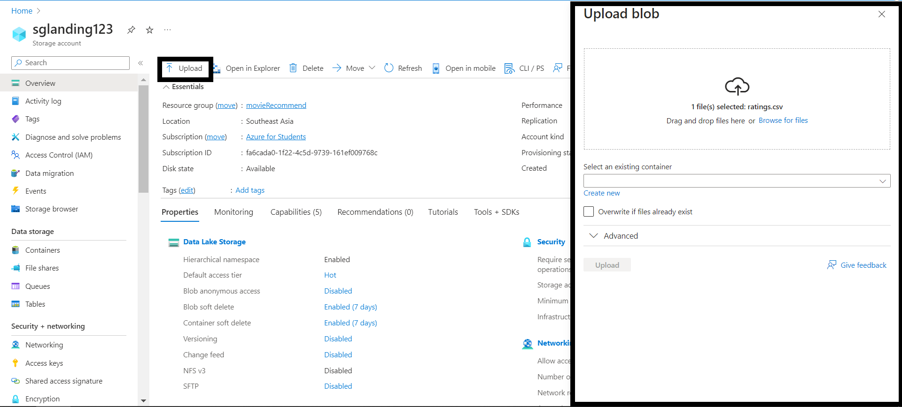

# Movie recommend data pipeline with Azure

In this project i will help you to build a complete Data pipeline for Movie Recommendation using Azure services. 

### Table of contents

* [Architecture diagram](#architecture-diagram)
* [Overview](#overview)
* [Why Azure?](#why-azure)
* [How it works](#how-it-works)
    * [Data ingestion](#data-ingestion)
    * [Data flow](#data-flow)
    * [Data access](#data-access)
* [Prerequisites](#prerequisites)
* [References](#references)
* [Demo](#demo)
* [Contact](#contact)

## Architecture diagram

## Overview
* Datasets from [Movielens](https://grouplens.org/datasets/movielens/)(with the rating and movie up to 25M).
* Store the data in [Azure Blob Storage](https://azure.microsoft.com/en-us/products/storage/blobs).
* Transformation using [Azure Databricks](https://azure.microsoft.com/en-us/products/databricks).
* Orchestration the data pipeline in [Azure DataFactory](https://azure.microsoft.com/en-us/products/data-factory).
* And several components [Azure Logic App](https://learn.microsoft.com/en-us/azure/logic-apps/logic-apps-overview),[Azure Active Directory](https://learn.microsoft.com/en-us/azure/logic-apps/logic-apps-overview),[Key Vault](https://azure.microsoft.com/en-us/products/key-vault)...

### Why Azure?
*  For me it kind of simple because [Azure](https://azure.microsoft.com/en-us/free/students) gives free credits for new user, and can access all the services (In this project i use my email of my university and get free $100 credits without Visa or debit card)
* And of course, plenty of resources to learn from...

## How it works

###  Data ingestion
Ingest the data we have, thanks for [Movielens](https://grouplens.org/datasets/movielens/) give us milions of data from flat file, etc,...

- First task, we need to create a [Resource Group](https://learn.microsoft.com/en-us/azure/azure-resource-manager/management/manage-resource-groups-portal), A resource group is a container that holds related resources for an Azure solution.

- Within the Resource Group, create an "Azure Storage Account" to store your data files. Choose the type of storage (e.g., Blob storage) and specify the region for the storage account. Blob storage is suitable for storing unstructured data like movie data files (e.g., CSV files).
  
- Upload your movie data files to the Blob storage containers within the Azure Storage Account.
These files will be stored securely and can be accessed by Azure services for further processing and analysis.

- Configure Azure services such as Azure Data Factory or Azure Databricks to access and process the data stored in the Azure Storage Account.
These services can perform tasks like data transformations, ETL operations, and generating movie recommendations.

#### Data flow
- Raw data ingest to **Azure Blob storage**, we can trigger the pipeline run whenever the data come (I will show you later).
- We transform using **Azure Databricks** and get the validated data and rejected data.
- Then we orchestrate the ETL using **Azure DataFactory**,
- Addtionally, I will show you how to use **Key Vault** to store you identify, and use that to mount the services with each others.
- Eventually the notebook we run in **Azure Databricks** give outs the result to us, then we have **Azure Logic App** send the movie recommendation to us.

#### Data access
- Data gathered by previous steps can be easily accessed in [MoviesLen](api) and [API](api) using public endpoints.

<!-- PREREQUISITES -->
## Prerequisites
What you need to run the project:
- [Azure account](https://azure.microsoft.com/en-us/) - You must have to have at least $15 for this project and more for further use.
- [Azure Databricks](https://azure.microsoft.com/en-us/products/databricks) - I highly recommend using you account Azure Databricks, not the community edition (its will not give you permission to generate the Databricks token for external connection).
- [Documents](https://portal.azure.com/#home) - Check the documents for update and stay up-to-date.
<!-- RUNNING PROJECT -->
## Running project
- There's two way to run this project:

    -- First one is use can trigger the pipeline in **Azure DataFactory** with the ETL and mounting pre-defined.

     
    -- Second one is the pipeline have been automated trigger whenever there's a file upload in to the specific location.

- First way using manually trigger:  
  

- Second way load the file to **Blob storage**:
  

<!-- REFERENCES -->
## References
Inspired by following codes, articles and videos:

* [Amazing tutor, and a youtuber providing such details video](https://github.com/yourhadooptutor)
* [Document and answers by Microsoft](https://azure.microsoft.com/en-us/)
* [Mounting and configuration on your choice](https://www.youtube.com/watch?v=8YL8T0kw75M)

## Demo
- Link to the Demo:  
  [Link](https://www.youtube.com/playlist?list=PLId1IInL1tup-76xOBJcgUi2A5fy2eGTc)

<!-- CONTACT -->
## Contact
Please feel free to contact me if you have any questions.

